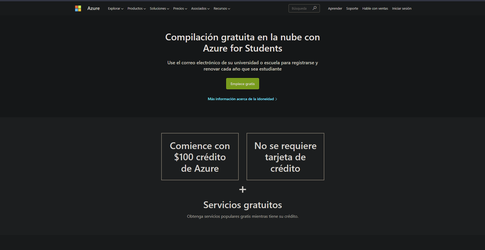
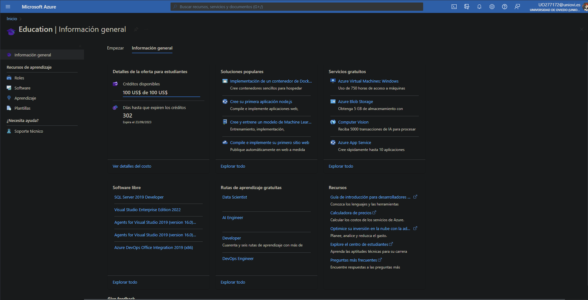
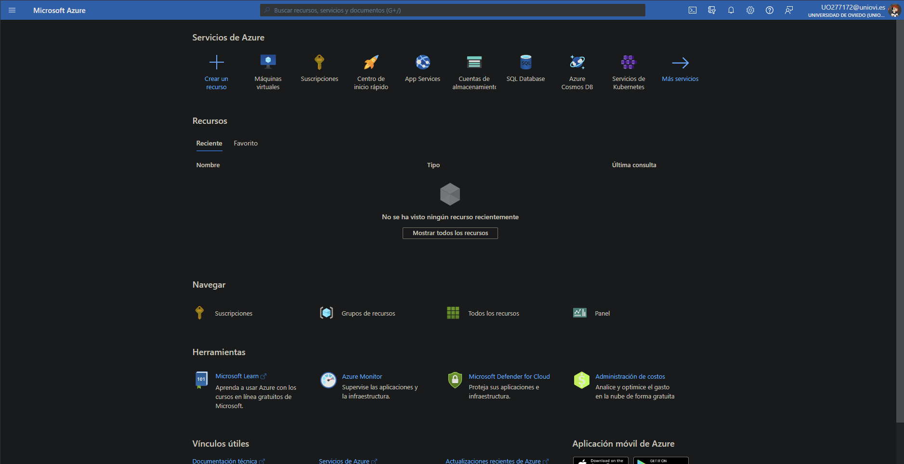
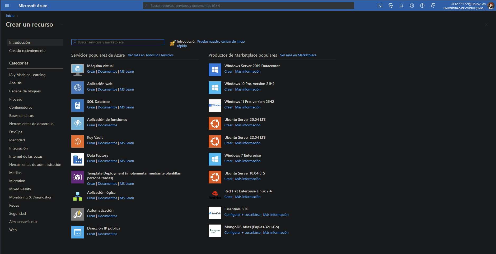
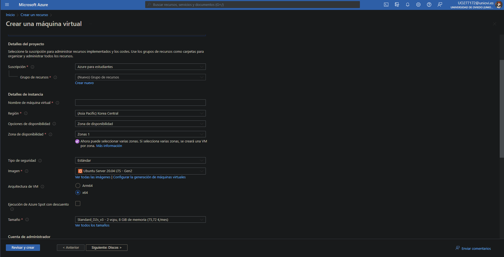

# Trabajo 1

## Creación de la cuenta de azure
### Fecha - 23 / 09 / 2022

#### Creación de la cuenta de Azure
- Para comenzar entro en la página de Azure Students donde se me mostrará el siguiente contenido. En este procederé a clickar en ***Empieza aquí*** para comenzar la creación de la cuenta de azure

- Después de esto simplemente nos mandará introducir nuestro correo electrónico y contraseña de nuestra cuenta de estudiante para verificarnos como estudiante y nos llevará a la pantalla del servicio

#### Creación de la Máquina virtual linux
- Para crear nuestra máquina virtual primero pulsamos en el menú superior izquierdo que viene indicado con 3 líneas y le damos a home

- En este apartado nos dirigiremos al botón de ***Crear un recurso*** y veremos lo siguiente

- Al pulsar en el vinculo *Crear* situado debajo del recurso *Máquina virtual* nos mandará a la pantalla de creación de la misma donde podemos configurarla a nuestro gusto

#### Comparación de las cuentas de estudiante AWS, Azure y Google

#### La ciberseguridad en la nube